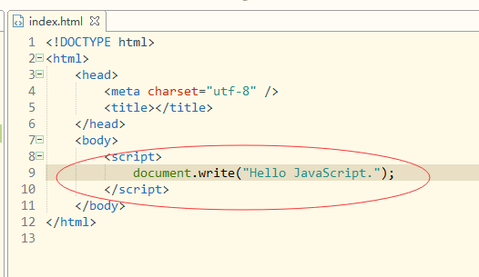

> Author：Amy
>
> Version：9.0.2


[toc]


### 一、引言

---

#### 1.1 JavaScript简介

> + JavaScript一种解释性脚本语言，是一种动态类型、弱类型、基于原型继承的语言，内置支持类型。
> + 它的解释器被称为JavaScript引擎，作为浏览器的一部分，广泛用于客户端的脚本语言，用来给HTML网页增加动态功能。

#### 1.2 JavaScript组成部分

> + [ECMAScript语法]()
>
> + [文档对象模型（DOM Document Object Model）]()
>
> + [浏览器对象模型(BOM Browser Object Model)]()

#### 1.2 JavaScript发展史

> - 它是由Netscape公司的Brendan Eich用10天设计出来一门脚本语言，JavaScript是甲骨文公司的注册商标。完整的JavaScript实现包含三个部分：ECMAScript，文档对象模型，浏览器对象模型。
> - Netscape在最初将其脚本语言命名为LiveScript，后来Netscape在与Sun合作之后将其改名为JavaScript。JavaScript最初受Java启发而开始设计的，目的之一就是“看上去像Java”，因此语法上有类似之处，一些名称和命名规范也借自Java。但JavaScript的主要设计原则源自Self和Scheme。JavaScript与Java名称上的近似，是当时Netscape为了营销考虑与Sun微系统达成协议的结果。为了取得技术优势，微软推出了JScript来迎战JavaScript的脚本语言。两者都属于ECMAScript的实现，为了互用性，ECAM（欧洲计算机制造商协会）创建了ECMA-262标准（ECMAScript）。ECMAScript最新版本是2015发布的 ECMAScript 6（ES6）。

#### 1.3 JavaScript环境搭建

> - 使用HBuilderX进行页面开发
> - 新建工程：文件->新建->普通HTML项目

|                        |
| :--------------------: |
|  |

>  创建一个< script >< /script >标签

|                            |
| :------------------------: |
|  |


> 运行效果：
>

|                            |
| :------------------------: |
|  |


> 还可以使用外部引用的形式：把原本的JavaScript代码写到一个文件里，之后再引用过来
>

```html
<html>
	<body>
		<script src="js/my.js"></script>
	</body>
</html>
```

### 二、JavaScript基本语法

---

#### 2.1 变量声明

> - 在JavaScript中，任何变量都用var关键字来声明，var是variable的缩写。
> - var是声明关键字，a是变量名，语句以分号结尾。
> - 这里值得注意的是，JavaScript中的关键字，不可以作为变量名。就像在Java中你不可以写"int int=1;"一样。

```javascript
var a;
```

> JavaScript的部分关键字：
>

```javascript
abstract、else、instanceof、super、boolean、enum、int、switch、break、export、interface、synchronized、byte、extends、let、this、case、false、long、throw、catch、final、native、throws、char、finally、new、transient、class、float、null、true、const、for、package、try、continue、function、private、typeof、debugger、goto、protected、var、default、if、public、void、delete、implements、return、volatile、do、import、short、while、double、in、static、with。
```

#### 2.2 基本类型

> - 变量的基本类型又有Number、String、Boolean、Undefined、Null五种。
> - 来声明一个数字Number类型，如下：

```javascript
var a=1;
```

> - 来声明一个字符串String类型。
>
> - 你可以使用:
>

```
var a="1";
```

> - 来声明一个布尔Boolean类型。
> - 你可以使用：

```javascript
var a=false;
```

> - 在Java中，当一个变量未被初始化的时候，Java中是null或者基本数据类型的默认值。
>
> - 在JavaScript中，当一个变量未被初始化的时候，它的值为undefined。
>
> - 下面是演示undefined的情况：(当一个引用不存在时，它为Null。这个现象我们在之后的引用类型时再详细探讨)
>

```javascript
var a;
document.write(a);
```

|                            |
| :------------------------: |
|  |


#### 2.3 引用类型

> 在Java中需要类定义，然后再实例对象：
>

```java
public class Student{
  public int id;
  public String name;
  public int age;
}
public class Test{
    public static void main(String [] args){
        Student student=new Student();
      	student.id=1;
      	student.name="张三";
      	student.age=18;
    }
}
```

> 在JavaScript中对象可以直接写出来：
>

```javascript
var student={id:1,name:"张三",age:18};
document.write(student.id);
document.write(student.name);
document.write(student.age);
```

|                            |
| :------------------------: |
|  |


> 事实上，student被赋值为了一个JSON，JSON就是我们在Java基础阶段学过的，全称是JavaScript Object Notation，叫做JavaScript对象标记，也就是说，在JavaScript中，JSON是用于标记一个对象的。
>

#### 2.4 数组类型

> - 数组就是和我们之前理解的数组概念一致，而在JavaScript中成为Array类型。
>
> - 我们说JSON可以标记一个对象，那么它同样可以标记一个数组，就是Java基础时我们学过的JSONArray。
>

```javascript
var a=[1,2,3,4];
```

> - 上述代码，我们说a是一个数组，在a中角标为0的元素是1。可以说这很简单。
>
> - 接下来我们来尝试把之前的JSON放入数组中：
>

```js
//我是注释
/*我也是注释*/
var students = [
    {id: 1,name: "张三",age: 18},
    {id: 2,name: "李四",age: 18},
    {id: 3,name: "王五",age: 19}
];
document.write(students[0].id);
document.write(students[0].name);
document.write(students[0].age);
document.write("<br>");//这个是html的换行的意思
document.write(students[1].id);
document.write(students[1].name);
document.write(students[1].age);
document.write("<br>");
document.write(students[2].id);
document.write(students[2].name);
document.write(students[2].age);
```

> 运行结果

|                            |
| :------------------------: |
|  |


> 我们看到，访问students这个数组，第0个，第1个，第2个元素，都可以。
>

#### 2.5 运算符

> 逻辑运算

| 名称 | 运算符 | 描述                                                         |
| :--: | :----: | ------------------------------------------------------------ |
|  与  |   &&   | 要求表达式左右两边的表达式同为true，整体结果才为true         |
|  或  |  \|\|  | 要求表达式左右两边的表达式只要有一个为true，整体结果就为true |
|  非  |   ！   | 将布尔值取反操作                                             |

```javascript
var a=false;
var b=true;
//非的逻辑
//!a->true;
//!b->false;
//与的逻辑
//a&&a->false;
//a&&b->false;
//b&&a->false;
//b&&b->true;
//或的逻辑
//a||a->false;
//a||b->true;
//b||a->true;
//b||b->true;
```

> 关系运算

|     名称     | 运算符 |
| :----------: | :----: |
|     等于     |   ==   |
|     小于     |   <    |
|  小于或等于  |   <=   |
|     大于     |   >    |
|  大于或等于  |   >=   |
|    不等于    |   !=   |
| 值和类型相同 |  ===   |

```javascript
var a=1;
var b=2;
//a==a->true
//a==b->false
//a<b->false
//a<=b->false
//a>b->true
//a>=b->true
//a!=b->true
//a===b->false
//这里三个等于“===”和两个等于“==”区别：
//前者相当于比较两个引用，后者相当于比较两个值。
//当比较两个值得时候，不考虑数据类型。
//也就是说1=="1"是true的。
```

>  单目运算：自增自减

| 名称 | 运算符 |            描述             |
| :--: | :----: | :-------------------------: |
| 自增 |   ++   | 变量的值每次加1，再赋给变量 |
| 自减 |   --   | 变量的值每次减1，再赋给变量 |

```javascript
var a=1;
a++;//自增
a--;//自减
++a;//自增
--a;//自减
//上述规则和Java一样。
```

> 双目运算符

| 名称   | 运算符 |
| ------ | ------ |
| 加     | +      |
| 减     | -      |
| 乘     | *      |
| 除     | /      |
| 求余   | %      |
| 赋值   | =      |
| 加等   | +=     |
| 减等   | -=     |
| 除等   | /=     |
| 乘等   | *=     |
| 求余等 | %=     |

```javascript
var a=1;
var b=2;
a+b;//相加
a-b;//相减
a*b;//相乘
a/b;//相除
a%b;//求余
a=b;//赋值
a+=b;//相加后赋值
a-=b;//相减后赋值
a/=b;//相除后赋值
a*=b;//相乘后赋值
a%=b;//求余后赋值
//上述规则和Java一样。
```

> 三目运算符： ?:

```javascript
var kk=100;	
document.write(kk>100?true:false);
```

#### 2.6 条件分支结构

> if-else分支

```javascript
var a=1;
var b=1;
if(a==b){
    document.write("相等");
}else{
    document.write("不相等");
}
//很明显，运行结果是相等
//这就是if-else的结构，和Java语言是一样的。
```

> switch分支

```javascript
var a=2;
switch(a){
  case 1:
    document.write("值为1");
    break;
  case 2:
    document.write("值为2");
    break;
  case 3:
    document.write("值为3");
    break;
  default:
     document.write("值不是3也不是2也不是1");
}
```

#### 2.7 循环结构

>  for循环

```
var a=0;
for(var i=1;i<=100;i++){
    a+=i;
}
document.write(a);
//上述代码是对1~100求和。
```

> while循环

```javascript
var a=0;
var i=1;
while(i<=100){
   a+=i;
   i++;
}
document.write(a);
//上述代码是对1~100求和。
```

> do-while循环

```javascript
var a=0;
var i=1;
do{
    a+=i;
  	i++;
}while(i<=100);
document.write(a);
//上述代码是对1~100求和。
```

> - break与continue关键字
>   - break用于结束循环
>   - continue用于结束本次循环

#### 2.8 函数【`重点`】

> 函数定义：用function关键字来声明，后面是方法名字，参数列表里不写var。整个方法不写返回值类型。

```javascript
function functionName(parameters){
    //执行的代码
}
```

> 方法的定义与调用举例：
>

```javascript
function add(a,b){
    return a+b;
}
var c=1;
var d=2;
var e=add(1,2);
document.write(e);
//上述代码运行结果是3
//这里定义了一个add方法，参数是两个，与Java不同，参数的数据类型并没有。
//因为就算是写，全都是var，为了保证语法的简洁性，全写var索性就设计成全都不用写了。
//返回值也是同样的道理，区别是，如果你写了返回值，那么有返回值，如果没写return，就没有返回值。
```

#### 2.9 常见弹窗函数

> - alert弹框：这是一个只能点击确定按钮的弹窗
> - alert方法没有返回值，也就是说如果用一个变量去接受返回值，将会得到undefined。无论你点击“确定”还是右上角的那个“X“关闭。

```javascript
alert("你好");
```


|                            |
| :------------------------: |
|  |


> - confirm弹框：这是一个你可以点击确定或者取消的弹窗
> - confirm方法与alert不同，他的返回值是boolean，当你点击“确定”时，返回true，无论你点击“取消”还是右上角的那个“X“关闭，都返回false。

```javascript
confirm("你好");
```

运行结果：


|                            |
| :------------------------: |
|  |


> - prompt弹框：这是一个你可以输入文本内容的弹窗
>   - 第一个参数是提示信息，第二个参数是用户输入的默认值。
> - 当你点击确定的时候，返回用户输入的内容。当你点击取消或者关闭的时候，返回null。

```javascript
prompt("你爱学习吗？","爱");
```

|                            |
| :------------------------: |
|  |


#### 2.10 事件

| 事件名称    | 描述                         |
| ----------- | ---------------------------- |
| onchange    | HTML 元素内容改变            |
| onclick     | 用户点击 HTML 元素           |
| onmouseover | 用户将鼠标移入一个HTML元素中 |
| onmousemove | 用户在一个HTML元素上移动鼠标 |
| onmouseout  | 用户从一个HTML元素上移开鼠标 |
| onkeyup     | 键盘                         |
| onkeydown   | 用户按下键盘按键             |
| onload      | 浏览器已完成页面的加载       |
| onsubmit    | 表单提交                     |

#### 2.11 正则表达式

> - 正则表达式是描述字符模式的对象。
>
> - 正则表达式用于对字符串模式匹配及检索替换，是对字符串执行模式匹配的强大工具。
>
> - 语法：
>   - var patt=new RegExp(pattern,modifiers);
>   - var patt=/pattern/modifiers;

```javascript
var re = new RegExp("\\w+");
var re = /\w+/;
```

> 修饰符：用于执行区分大小写和全局匹配:

| 修饰符 | 描述                                                     |
| ------ | -------------------------------------------------------- |
| i      | 执行对大小写不敏感的匹配。                               |
| g      | 执行全局匹配（查找所有匹配而非在找到第一个匹配后停止）。 |
| m      | 执行多行匹配。                                           |

> 方括号：用于查找某个范围内的字符

| 表达式             | 描述                               |
| ------------------ | ---------------------------------- |
| [abc\]             | 查找方括号之间的任何字符。         |
| [^abc\]            | 查找任何不在方括号之间的字符。     |
| [0-9]              | 查找任何从 0 至 9 的数字。         |
| [a-z]              | 查找任何从小写 a 到小写 z 的字符。 |
| [A-Z]              | 查找任何从大写 A 到大写 Z 的字符。 |
| [A-z]              | 查找任何从大写 A 到小写 z 的字符。 |
| [adgk]             | 查找给定集合内的任何字符。         |
| [^adgk]            | 查找给定集合外的任何字符。         |
| (red\|blue\|green) | 查找任何指定的选项。               |

> 元字符（Metacharacter）：是拥有特殊含义的字符：
>

| 元字符 | 描述                                                         |
| ------ | ------------------------------------------------------------ |
| .      | 查找单个字符，除了换行和行结束符。                           |
| \w     | 查找单词字符。                                               |
| \W     | 查找非单词字符。                                             |
| \d     | 查找数字。                                                   |
| \D     | 查找非数字字符。                                             |
| \s     | 查找空白字符。                                               |
| \S     | 查找非空白字符。                                             |
| \b     | 匹配单词边界。                                               |
| \B     | 匹配非单词边界。                                             |
| \0     | 查找 NULL 字符。                                             |
| \n     | 查找换行符。                                                 |
| \f     | 查找换页符。                                                 |
| \r     | 查找回车符。                                                 |
| \t     | 查找制表符。                                                 |
| \v     | 查找垂直制表符。                                             |
| \xxx   | 查找以八进制数 xxx 规定的字符。                              |
| \xdd   | 查找以十六进制数 dd 规定的字符。                             |
| \uxxxx | 查找以十六进制数 xxxx 规定的 Unicode 字符。（如中文utf-8编码范围：\u4e00-\u9fa5） |

> 量词：用于表示重复次数的含义
>

| 量词   | 描述                                                         |
| ------ | ------------------------------------------------------------ |
| n+     | 匹配任何包含至少一个 n 的字符串。例如，/a+/ 匹配 "candy" 中的 "a"，"caaaaaaandy" 中所有的 "a"。 |
| n*     | 匹配任何包含零个或多个 n 的字符串。例如，/bo*/ 匹配 "A ghost booooed" 中的 "boooo"，"A bird warbled" 中的 "b"，但是不匹配 "A goat grunted"。 |
| n?     | 匹配任何包含零个或一个 n 的字符串。例如，/e?le?/ 匹配 "angel" 中的 "el"，"angle" 中的 "le"。 |
| n{X}   | 匹配包含 X 个 n 的序列的字符串。例如，/a{2}/ 不匹配 "candy," 中的 "a"，但是匹配 "caandy," 中的两个 "a"，且匹配 "caaandy." 中的前两个 "a"。 |
| n{X,}  | X 是一个正整数。前面的模式 n 连续出现至少 X 次时匹配。例如，/a{2,}/ 不匹配 "candy" 中的 "a"，但是匹配 "caandy" 和 "caaaaaaandy." 中所有的 "a"。 |
| n{X,Y} | X 和 Y 为正整数。前面的模式 n 连续出现至少 X 次，至多 Y 次时匹配。例如，/a{1,3}/ 不匹配 "cndy"，匹配 "candy," 中的 "a"，"caandy," 中的两个 "a"，匹配 "caaaaaaandy" 中的前面三个 "a"。注意，当匹配 "caaaaaaandy" 时，即使原始字符串拥有更多的 "a"，匹配项也是 "aaa"。 |
| n{X}   | 前面的模式 n 连续出现X 次时匹配                              |
| n$     | 匹配任何结尾为 n 的字符串。                                  |
| ^n     | 匹配任何开头为 n 的字符串。                                  |
| ?=n    | 匹配任何其后紧接指定字符串 n 的字符串。                      |
| ?!n    | 匹配任何其后没有紧接指定字符串 n 的字符串。                  |

> RegExp 对象方法
>

| 方法    | 描述                                               |
| ------- | -------------------------------------------------- |
| compile | 编译正则表达式。                                   |
| exec    | 检索字符串中指定的值。返回找到的值，并确定其位置。 |
| test    | 检索字符串中指定的值。返回 true 或 false。         |

> 支持正则表达式的 String 对象的方法

| 方法    | 描述                             |
| ------- | -------------------------------- |
| search  | 检索与正则表达式相匹配的值。     |
| match   | 找到一个或多个正则表达式的匹配。 |
| replace | 替换与正则表达式匹配的子串。     |
| split   | 把字符串分割为字符串数组。       |

> 正则表达式的使用
>
> - test方法：搜索字符串指定的值，根据结果并返回真或假
> - exec() 方法：检索字符串中的指定值。返回值是被找到的值。如果没有发现匹配，则返回 null。

```javascript
var patt1=new RegExp("e");
document.write(patt1.test("The best things in life are free"));
```

```javascript
var patt1=new RegExp("e");
document.write(patt1.exec("The best things in life are free"));
```

### 三、JavaScript的DOM【`重点`】

---

#### 3.1 概述

> - 通过 HTML DOM，可访问 JavaScript HTML 文档的所有元素。
>
> - 当网页被加载时，浏览器会创建页面的文档对象模型（Document Object Model）。
>
> - **HTML DOM** 模型被构造为**对象**的树：

|                             |
| :-------------------------: |
|  |


> - 通过可编程的对象模型，JavaScript 获得了足够的能力来创建动态的 HTML。
>   - JavaScript 能够改变页面中的所有 HTML 元素。
>   - JavaScript 能够改变页面中的所有 HTML 属性。
>   - JavaScript 能够改变页面中的所有 CSS 样式。
>   - JavaScript 能够对页面中的所有事件做出反应。
>

#### 3.2 查找HTML元素

> - 通常，通过 JavaScript，您需要操作 HTML 元素。
>
>
> - 为了做到这件事情，您必须首先找到该元素。有三种方法来做这件事：
>   - 通过 id 找到 HTML 元素
>     - 在 DOM 中查找 HTML 元素的最简单的方法，是通过使用元素的 id。
>     - 方法：document.getElementById("id属性值");
>     - 如果找到该元素，则该方法将以对象（在 x 中）的形式返回该元素。
>     - 如果未找到该元素，则 x 将包含 null。
>   - 通过标签名找到 HTML 元素
>     - 方法：getElementsByTagName("合法的元素名");
>   - 通过类名找到HTML 元素
>     - 方法：getElementsByClassName("class属性的值")
>

#### 3.3 改变HTML

>  改变HTML输出流：document.write() 可用于直接向 HTML 输出流写内容

```html
<!DOCTYPE html>
<html>
<body>
<script>
document.write("Hello world,I'm JavaScript");
</script>
</body>
</html>
```

|                             |
| :-------------------------: |
|  |


> 改变HTML内容：使用 innerHTML 属性

```html
<html>
<body>
<p id="p1">Hello World!</p>
<script>
document.getElementById("p1").innerHTML="abcd";
</script>
</body>
</html>
```

|                             |
| :-------------------------: |
|  |


> - 改变HTML属性：document.getElementById(*id*).attribute=新属性值
> - 将attribute替换成真实的属性名

```html
<!DOCTYPE html>
<html>
<body>

<script>
document.getElementById("image").src="2.jpg";
</script>
</body>
</html>
```

#### 3.4 CSS变化

> - 对象.style.property=新样式
> - 将property替换成真实的css属性名

```html
<!DOCTYPE html>
<html>
<head>
<meta charset="utf-8">
</head>
<body>
 
<p id="p1">Hello World!</p>
<p id="p2">Hello World!</p>
<script>
document.getElementById("p2").style.color="blue";
document.getElementById("p2").style.fontFamily="Arial";
document.getElementById("p2").style.fontSize="larger";
</script>
<p>以上段落通过脚本修改。</p>
 
</body>
</html>
```

|                             |
| :-------------------------: |
|  |


#### 3.5 DOM事件

> - HTML DOM 允许我们通过触发事件来执行代码。·
> - 比如以下事件：
>   - 元素被点击。
>   - 页面加载完成。
>   - 输入框被修改。
> - 本例改变了 id="id1" 的 HTML 元素的样式，当用户点击按钮时

```html
<!DOCTYPE html>
<html>
<body>

<h1 id="id1">myH1</h1>
<button type="button" 
onclick="document.getElementById('id1').style.color='red'">
button</button>

</body>
</html>
```

> 点击前
>


|                             |
| :-------------------------: |
|  |


> 点击后
>

|                             |
| :-------------------------: |
|  |


> - HTML DOM 使 JavaScript 有能力对 HTML 事件做出反应。
>   - 在本例中，当用户在 h1 元素上点击时，会改变其内容：

```html
<!DOCTYPE html>
<html>
<body>
<h1 onclick="this.innerHTML='Ooops!'">点击文本!</h1>
</body>
</html>
```

> 本例从事件处理器调用一个函数：
>

```html
<!DOCTYPE html>
<html>
<head>
<script>
function changetext(id)
{
    id.innerHTML="Ooops!";
}
</script>
</head>
<body>
<h1 onclick="changetext(this)">点击文本!</h1>
</body>
</html>
```

> 如需向 HTML 元素分配 事件，您可以使用事件属性。
>

```html
<button onclick="displayDate()">点这里</button>
```

> HTML DOM 允许您使用 JavaScript 来向 HTML 元素分配事件：
>

```html
<script>
document.getElementById("myBtn").onclick=function(){displayDate()};
</script>
```

#### 3.6 EventListener

> addEventListener() 方法
>
> - 在用户点击按钮时触发监听事件
>

```javascript
document.getElementById("myBtn").addEventListener("click", displayDate);
```

> - addEventListener() 方法用于向指定元素添加事件句柄。
>
> - addEventListener() 方法添加的事件句柄不会覆盖已存在的事件句柄。
>
> - 你可以向一个元素添加多个事件句柄。
>
> - 你可以向同个元素添加多个同类型的事件句柄，如：两个 "click" 事件。
>
> - 你可以向任何 DOM 对象添加事件监听，不仅仅是 HTML 元素。如： window 对象。
>
> - addEventListener() 方法可以更简单的控制事件（冒泡与捕获）。
>
> - 当你使用 addEventListener() 方法时, JavaScript 从 HTML 标记中分离开来，可读性更强， 在没有控制HTML标记时也可以添加事件监听。
>

> 你可以使用 removeEventListener() 方法来移除事件的监听。
>

```javascript
element.addEventListener(event, function, useCapture);
```

|   参数名   |                    描述                    |
| :--------: | :----------------------------------------: |
|   event    |   事件的类型 (如 "click" 或 "mousedown")   |
|  function  |            事件触发后调用的函数            |
| useCapture | 用于描述事件是冒泡还是捕获。该参数是可选的 |

> 当用户点击元素时弹出 "Hello World!" :
>

```javascript
element.addEventListener("click", myFunction);

function myFunction() {
    alert ("Hello World!");
}
```

> addEventListener() 方法允许向同个元素添加多个事件，且不会覆盖已存在的事件：
>

```javascript
element.addEventListener("click", myFunction);
element.addEventListener("click", mySecondFunction);
```

> 你可以向同个元素添加不同类型的事件：
>

```html
element.addEventListener("mouseover", myFunction);
element.addEventListener("click", mySecondFunction);
element.addEventListener("mouseout", myThirdFunction);
```

> - addEventListener() 方法允许你在 HTML DOM 对象添加事件监听， HTML DOM 对象如： HTML 元素, HTML 文档, window 对象。或者其他支出的事件对象如: xmlHttpRequest 对象。
>
> - 当用户重置窗口大小时添加事件监听：
>

```html
window.addEventListener("resize", function(){
    document.getElementById("demo").innerHTML = sometext;
});
```

> - 事件传递有两种方式：冒泡与捕获。
>
> - 事件传递定义了元素事件触发的顺序。 如果你将 p 元素插入到 div元素中，用户点击p 元素, 哪个元素的 "click" 事件先被触发呢？
>   - 在 *冒泡 *中，内部元素的事件会先被触发，然后再触发外部元素，即：p 元素的点击事件先触发，然后会触发 div 元素的点击事件。
>   - 在 *捕获 *中，外部元素的事件会先被触发，然后才会触发内部元素的事件，即：div 元素的点击事件先触发 ，然后再触发 p元素的点击事件。
> - addEventListener() 方法可以指定 "useCapture" 参数来设置传递类型：
>

```html
addEventListener(event, function, useCapture);
```

> 默认值为 false, 即冒泡传递，当值为 true 时, 事件使用捕获传递。
>

```html
document.getElementById("myDiv").addEventListener("click", myFunction, true);
```

> removeEventListener() 方法移除由 addEventListener() 方法添加的事件句柄:
>

```html
element.removeEventListener("mousemove", myFunction);
```

#### 3.7 操作元素

> - 如需向 HTML DOM 添加新元素，您必须首先创建该元素（元素节点），然后向一个已存在的元素追加该元素。
>   - 创建元素：document.createElement()
>   - 追加元素：appendChild()

```javascript
<div id="div1">
<p id="p1">这是一个段落。</p>
<p id="p2">这是另一个段落。</p>
</div>

<script>
var para=document.createElement("p");
var node=document.createTextNode("这是一个新段落。");
para.appendChild(node);

var element=document.getElementById("div1");
element.appendChild(para);
</script>
```

> -  删除已有的 HTML 元素
> - 使用方法：removeChild()

```html
<div id="div1">
<p id="p1">这是一个段落。</p>
<p id="p2">这是另一个段落。</p>
</div>
<script>
var parent=document.getElementById("div1");
var child=document.getElementById("p1");
parent.removeChild(child);
</script>
```

### 四、浏览器BOM

---

> - 浏览器对象模型 (BOM-Browser Object Model) 使 JavaScript 有能力与浏览器"对话"。
>
> - 由于现代浏览器已经（几乎）实现了 JavaScript 交互性方面的相同方法和属性，因此常被认为是 BOM 的方法和属性。
>

#### 4.1 window

> - 所有浏览器都支持 window 对象。它表示浏览器窗口。
>
> - 所有 JavaScript 全局对象、函数以及变量均自动成为 window 对象的成员。
>
> - 全局变量是 window 对象的属性。
>
> - 全局函数是 window 对象的方法。
>
> - 甚至 HTML DOM 的 document 也是 window 对象的属性之一：
>

> - ######  window的尺寸
>
>   - 对于Internet Explorer、Chrome、Firefox、Opera 以及 Safari：
>
>     - window.innerHeight - 浏览器窗口的内部高度(包括滚动条)
>     - window.innerWidth - 浏览器窗口的内部宽度(包括滚动条)
>
>   - 对于 Internet Explorer 8、7、6、5：
>
>     - document.documentElement.clientHeight
>
>     - document.documentElement.clientWidth
>
>       或者
>
>     - document.body.clientHeight
>
>     - document.body.clientWidth

```javascript
var w=window.innerWidth||document.documentElement.clientWidth||document.body.clientWidth;
var h=window.innerHeight||document.documentElement.clientHeight||document.body.clientHeight;
```

> - ###### Window Screen
>
>   - 可用宽度：screen.availWidth 属性返回访问者屏幕的宽度，以像素计，减去界面特性，比如窗口任务栏。
>   - 可用高度：screen.availHeight 属性返回访问者屏幕的高度，以像素计，减去界面特性，比如窗口任务栏。

```javascript
document.write("可用宽度: " + screen.availWidth);
document.write("可用高度: " + screen.availHeight);
```

> - ######  Window Location
>   - window.location 对象用于获得当前页面的地址 (URL)，并把浏览器重定向到新的页面。
>   - window.location 对象在编写时可不使用 window 这个前缀。 一些例子：
>     - location.hostname 返回 web 主机的域名
>     - location.pathname 返回当前页面的路径和文件名
>     - location.port 返回 web 主机的端口 （80 或 443）
>     - location.protocol 返回所使用的 web 协议（http:// 或 https://）
>     - location.href 属性返回当前页面的 URL
>     - location.assign() 方法加载新的文档

```html
<html>
<head>
<script>
function newDoc()
  {
  window.location.assign("http://www.baidu.com/")
  }
</script>
</head>
<body>
<input type="button" value="Load new document" onclick="newDoc()">
</body>
</html>
```

> - **Window History**
>   - window.history 对象包含浏览器的历史。
>   - window.history 对象在编写时可不使用 window 这个前缀。
>     - history.back() 
>     - history.forward()
>   - 一些方法示例如下：

> history.back() - 与在浏览器点击后退按钮相同

```html
<html>
<head>
<script>
function goBack()
  {
  window.history.back()
  }
</script>
</head>
<body>

<input type="button" value="Back" onclick="goBack()">

</body>
</html>
```

> history.forward() - 与在浏览器中点击按钮向前相同

```html
<html>
<head>
<script>
function goForward()
  {
  window.history.forward()
  }
</script>
</head>
<body>

<input type="button" value="Forward" onclick="goForward()">

</body>
</html>
```

> - ###### Window Navigator
>
>   - window.navigator 对象在编写时可不使用 window 这个前缀。

```html
<div id="example"></div>
<script>
txt = "<p>浏览器代号: " + navigator.appCodeName + "</p>";
txt+= "<p>浏览器名称: " + navigator.appName + "</p>";
txt+= "<p>浏览器版本: " + navigator.appVersion + "</p>";
txt+= "<p>启用Cookies: " + navigator.cookieEnabled + "</p>";
txt+= "<p>硬件平台: " + navigator.platform + "</p>";
txt+= "<p>用户代理: " + navigator.userAgent + "</p>";
txt+= "<p>用户代理语言: " + navigator.systemLanguage + "</p>";
document.getElementById("example").innerHTML=txt;
</script> 
```

#### 4.2 JavaScript定时器

> - 定义定时器：
>   - setInterval('调用函数',毫秒时间)：每间隔固定毫秒值就执行一次函数
>   - setTimeout('调用函数',毫秒时间)：在固定时间之后执行一次调用函数
> - 关闭定时器：
>   - clearInterval(定时器名称)
>   - clearTimeout(定时器名称)

