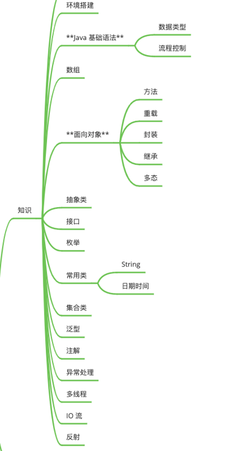

# 学习笔记

介绍一下我学习知识点的方法，和做题类似的方法，

第一，先知道概念，然后知道怎么用

第二，知道怎么用是错的，为什么错是扩展。

第三，要注意什么的事情。

## 1.1类与对象

类，java里叫class，一个类就比如，一类人（热爱二次元的一类人）把拥有共同属性和行为的集合称为一个类。

成员变量，类里面的属性

成员方法，类里面的方法

对象，object，一个类里面的实例，比如在一类（热爱二次元的人）中的一个人。

用法，

步骤一：对类进行实例化（创建一个对象，或者得到一个实例）

​		类名  对象 = new 类名（）;

​		比如：Phone  huaweiPhone = new Phone();

步骤二：通过对象操作对象的属性和行为

​		类里面：定义的属性  和  行为 （对具有共同特性事务的抽象）

​		操作属性和行为：通过类的具体体现去操作，其实就是通过对象来操作属性和行为。

​		操作属性： 

​				对象.属性=值；//给属性设置值

​	       		数据类型 变量名称 = 对象.属性；//获取值

​		操作行为： 

​				对象.方法名称（参数）；

```java
class Cartoon {//创建一个动漫类

    String drama;//类的属性，番剧

    public static void look() {
        System.out.println("我看动漫");
    }

    cartoon a1 = new cartoon();//a1是动漫类的一个实列
    
}
```

错误的语法idea有提示，

## 1.2内存分配


   1.分清什么是实例什么是对象。Class a= new Class();此时a叫实例，而不能说a是对象。

实例在栈中，对象在堆中，操作实例实际上是通过实例的指针间接操作对象。多个实例可以指向同一个对象。

2. 栈中的数据和堆中的数据销毁并不是同步的。方法一旦结束，栈中的局部变量立即销毁，但是堆中对象不一定销毁。因为可能有其他变量也指向了这个对象，直到栈中没有变量指向堆中的对象时，它才销毁，而且还不是马上销毁，要等垃圾回收扫描时才可以被销毁。

基本类型和基本类型的包装类。基本类型有：byte、short、char、int、long、boolean。基本类型的包装类分别是：Byte、Short、Character、Integer、Long、Boolean。注意区分大小写。二者的区别是：基本类型体现在程序中是普通变量，基本类型的包装类是类，体现在程序中是引用变量。因此二者在内存中的存储位置不同：

基本类型存储在栈中，而基本类型包装类存储在堆中。


## 1.3构造器

```java
cartoon a1 = new cartoon();
```

cartoon（），就是一个默认构造器public cartoon() {}为无参构造

构造器是一个类中的特殊方法，用来构造和创建一个新的对象。

```java
public cartoon() {
    //无参构造器
}

public cartoon(cartoon a1) {
    //有参构造器
}
```

- 空构造器特点
- 数字初始化为`0`
- 布尔类型初始化为`false`
- 引用类型初始化为`null`

我们可以定义有参构造器来对属性进行初始化：

```java
// 方式1属性赋值
public Employee(int baseSalary, int hourlyRate) {
  this.baseSalary = baseSalary;
  this.hourlyRate = hourlyRate;
}

// 方式2调用方法
public Employee(int baseSalary, int hourlyRate) {
  setBaseSalary(baseSalary);
  setHourlyRate(hourlyRate);
}
```

构造器具备如下特点：

- 方法名与类名完全一致
- 方法没有显式的返回值
- 一旦定义了有参构造器，`JVM`将不会创建无参构造器（默认构造器）


## 1.4this关键字

```java


public class Demo06 {
    String name;
    int age;

    //   this.name是调用成员变量，（String name）是局部变量
    public Demo06(String name, int age) {
        this.name = name;
        this.age = age;
    }

    public void test01() {
        System.out.println("执行test01");
    }

    public void test02() {
        test01();//this调用成员方法
    }

    public Demo06() {
        System.out.println("无参构造");
    }

    public Demo06(String name) {
        this();
        this.name = name;//有参构造
        
//        只能在构造方法中使用this()调用其他的构造方法，不能在成员方法中使用。
//        在构造方法中使用this()调用构造方法的语句必须位于第一行，而且只能出现一次。
//        不能在一个类中的两个构造方法中使用this()互相调用
    }

}
```

## 1.5Getters和Setters

首先，get方法是获取值，set方法是赋值，

```java
package cs.作业.day713;

public class Demo05 {
    public String name;//公共的
    protected String name1;//保护的
    private String name2;//私有的

    public String getName() {
        System.out.println(name + "获取值");
        return name;
    }

    public void setName(String name) {
        this.name = name;
        System.out.println("赋值");
    }

    public String getName1() {
        return name1;
    }

    public void setName1(String name1) {
        this.name1 = name1;
    }

    public String getName2() {
        return name2;
    }

    public void setName2(String name2) {
        this.name2 = name2;
    }


}
```

```java
package cs.作业.day713;
//测试类
public class Test01 {
    public static void main(String[] args) {
        Demo05 demo05=new Demo05();
        demo05.name="b";
        demo05.name1="b1";
       // demo05.name2="b2";报错，显示name2是私有的不能直接赋值
        demo05.setName("a");
        demo05.setName1("a1");
        demo05.setName2("a2");//通过set方法可以给私有的name2赋值
        System.out.println(demo05.getName());//通过get方法获取值
    }
}
```

可以使用快捷键alt+insert快速生成

## 1.知识点图




## 1.6方法和重载

首先，什么是方法，方法是完成某个行为或者问题。

方法
命名规则：
首字母小写，如果名称由多个单词组成，从第二个单词的开始首字母大写

a. 方法是解决一类问题的步骤的有序组合

b. 方法包含于类中

c. 方法在程序中被创建，在其他地方被引用

修饰符 返回值类型 方法名(参数类型 参数名) {
    ...
     方法体
     ...
     return 返回值; //return可以终止方法
}

修饰符：这是可选的，告诉编译器如何调用该方法。定义了该方法的访问类型。
        返回值类型：方法可能会返回值。没有返回值returnValueType是关键字void。
        方法名：是方法的实际名称，方法名和参数表共同构成方法签名。
        参数类型：参数像是一个占位符。当方法被调用时，传递给参数，这个值被称为实参或变量。参数列表是指方法的参数类型、顺序和参数的个数。参数是可选的，方法可以不包含任何参数。
         形式参数：在方法被调用时用于接收外界输入的数据。
         实参：调用方法时实际传给方法的数据。
        方法体：方法体包含具体的语句，定义该方法的功能。

### 重载

从简单说，就是函数或者方法有相同的名称，但是参数列表不相同的情形，这样的同名不同参数的函数或者方法之间，互相称之为重载函数或者重载方法。在Java中同一个类中的2个或2个以上的方法可以有同一个名字，只要它们的参数声明不同即可。这种情况下，该方法就被称为重载，这个过程称为方法重载，最多的是在构造方法的重载

```java
void test(){
    System.out.println("测试1");
}
void test(String name){
    System.out.println("测试2");
}
void test(String name,int age){
    System.out.println("测试3");
}
void test(double n){
    System.out.println("测试4");
}
```

重写与重载的区别在

方法的重载和重写都是实现多态的方式，区别在于前者实现的是编译时的多态性，而后者实现的是运行时的多态性。

重载发生在一个类中，同名的方法如果有不同的参数列表（参数类型不同、参数个数不同或者二者都不同）则视为重载；

重写发生在子类与父类之间，重写要求子类被重写方法与父类被重写方法有相同的参数列表，有兼容的返回类型，比父类被重写方法更好访问，不能比父类被重写方法声明更多的异常

。重载对返回类型没有特殊的要求，不能根据返回类型进行区分。


## 1.7封装

封装，就好比我们把电脑主机装好了放一个主机盒子里，要用的时候就直接连接数据线，而不需要直接懂主板之类的。把一个一个有联系的对象组装起来，然后不能随便改变。

1、封装的含义：封装是实现面向对象程序设计的第一步，封装就是将数据或函数等集合在一个个的单元中（我们称之为类）。被封装的对象通常被称为抽象数据类型。

2、封装的作用：封装的作用在于保护或者防止代码（数据）被我们无意中破坏。在面向对象程序设计中数据被看作是一个中心的元素并且和使用它的函数结合的很密切，从而保护它不被其它的函数意外的修改。

3、如何封装：封装提供了一个有效的途径来保护数据不被意外的破坏。相比我们将数据（用域来实现）在程序中定义为公用的（public）我们将它们(fields)定义为私有的（private）在很多方面会更好。私有的数据可以用两种方式来间接的控制。第一种方法，我们使用传统的存、取方法。第二种方法我们用属性（property），使用属性不仅可以控制存取数据的合法性，同时也提供了“读写”、“只读”、“只写”灵活的操作方法。

4、什么情况下封装：编写实例类时，用到封装有很多好处，其中比较实际的是：

拒绝直接调用声明字段，保护内部数据，更安全；
重复调用，避免代码冗余，程序编写效率高。

```java
public class Student {//封装一个学生类
    private String name;//私有的名字
    private int age;//封装类里面的属性应该都是私有的，不能暴露的。
    //提供set和get方法

    public String getName() {
        return name;
    }

    public void setName(String name) {
        this.name = name;
    }

    public int getAge() {
        return age;
    }

    public void setAge(int age) {
        this.age = age;
    }
}
```

## 1.8继承

extands的意思是扩展。子类是父类的扩展

继承的本质是对某一批类的抽象，从而实现对现实世界的建模

继承就是子类继承父类的特征和行为，使得子类对象（实例）具有父类的实例域和方法，或子类从父类继承方法，使得子类具有父类相同的行为。

继承的作用：通过继承可以快速创建新的类，实现代码的重用，提高程序的可维护性，节省大量创建新类的时间，提高开发效率和开发质量。

class 父类{
    ...       //成员变量、成员方法
}
class 子类 extends 父类{
    ...       //类体
}

注意

子类不能选择性继承父类；
        Java不支持多重继承，但一个类可以实现多个接口，从而克服单继承的缺点；
        构造方法不会被子类继承，但可以从子类中调用父类的构造方法。
继承的优点
       继承过来的字段和方法，可以像任何其他字段和方法一样被直接使用；
       在子类中可以声明一个与父类中同名的新字段或静态方法，从而“隐藏”父类中的字段或方法；
        可以在子类中声明一个在父类中没有的新字段和方法；
        可以在子类中编写一个父类当中具有相同名的新实例方法，这称为“方法重写”或“方法覆盖”；
       可以在子类中编写一个调用父类构造方法的子类构造方法，既可以隐式地实现，也可以通过使用关键字super来实现。


当一个子类中一个实例方法具有与其父类中的一个实例方法相同的签名（指名称、参数个数和类型）和返回值时，称子类中的方法“重写”了父类的方法。例如：

```java
package cs.作业.day713;

class A {
    public void sayHello() {                      //输出英文欢迎
        System.out.println("Hello,Welcome to Java!!!");
    }

    public void sayBye() {
        System.out.println("GoodBye,everyone");
    }
}

class B extends A {
    public void sayHello() {                      //输出中文欢迎
        System.out.println("大家好，欢迎学习Java！！！");
    }
}

public class myfirst {
    public static void main(String[] args) {
        B b = new B();                                //创建子类B的一个实例对象，使用默认构造方法
        b.sayHello();                               //调用子类中重写的方法
        b.sayBye();                                 //调用父类中的方法
    }
}
```

### 重写

重写都是方法的重写，与方法的属性无关，方法的重写

重写需要有继承关系，子类重写父类的方法

1方法名必须相同

参数列表必须相同

修饰符范围可以扩大 public》protected》Default》private

抛出的异常，范围可以被缩小，但不能扩大

Alt+Insert ；override

在子类中被重写的方法，其访问权限允许大于但不允许小于被其重写的方法，例如：父类中一个受保护的实例方法(protected)在子类中可以是公共的(public)的，但不可以是私有的(private)。如果一个方法在父类中是static方法，那么在子类也必须是static方法；如果一个方法在父类中是实例方法，那么在子类中也必须是实例方法。

### object类

Object类是Java`java.lang`包下的核心类，**Object类是所有类的父类**，何一个类时候如果没有明确的继承一个父类的话，那么它就是Object的子类；

常用的是toSting（）方法和equals（）方法；

**toString()：取得对象信息，返回该对象的字符串表示**

**equals()：对象比较**

1. clone()

保护方法，实现对象的浅复制，只有实现了Cloneable接口才可以调用该方法，否则抛出CloneNotSupportedException异常。

2. getClass()

final方法，返回Class类型的对象，反射来获取对象。

3. toString()

该方法用得比较多，一般子类都有覆盖，来获取对象的信息。

4. finalize()

该方法用于释放资源。因为无法确定该方法什么时候被调用，很少使用。

5. equals()

比较对象的内容是否相等

6. hashCode()//现在不用了解

该方法用于哈希查找，重写了equals方法一般都要重写hashCode方法。这个方法在一些具有哈希功能的Collection中用到。

7. wait()//现在不用了解

wait方法就是使当前线程等待该对象的锁，当前线程必须是该对象的拥有者，也就是具有该对象的锁。wait()方法一直等待，直到获得锁或者被中断。wait(long timeout)设定一个超时间隔，如果在规定时间内没有获得锁就返回。

调用该方法后当前线程进入睡眠状态，直到以下事件发生。

其他线程调用了该对象的notify方法。
其他线程调用了该对象的notifyAll方法。
其他线程调用了interrupt中断该线程。
时间间隔到了。
此时该线程就可以被调度了，如果是被中断的话就抛出一个InterruptedException异常。

8. notify()//现在不用了解

该方法唤醒在该对象上等待的某个线程。

9. notifyAll()//现在不用了解

该方法唤醒在该对象上等待的所有线程。

### super

super调用父类

super,默认调用父类的无参构造

super调用父类的构造方法，必须在第一个

super必须只能出现在子类的方法或者构造方法

super和this，不能同时调用构造方法

super  this

代表对象不同

this，本身调用者这个对象

super 代表父类对象的引用

前提，this，没有继承也可以使用

super只能在继承条件才可以使用


```java
package cs.作业.day713;

class SuperClass {              //创建父类SuperClass
    private int n;            //声明一个私有变量n

    SuperClass() {             //父类无参数构造方法
        System.out.println("这是父类SuperClass无参数构造方法");
    }

    SuperClass(int n) {       //父类有参数构造方法
        System.out.println("这是父类SuperClass有参数构造方法");
        this.n = n;
    }
}

class SubClass extends SuperClass {     // SubClass类继承SuperClass类
    private int n;                       //声明一个私有变量n

    SubClass() {                          // 自动调用父类的无参数构造器
        System.out.println("这是子类无参数构造方法");
    }

    public SubClass(int n) {              //子类有参数构造方法
        super(300);                        //调用父类中带有参数的构造器
        System.out.println("这是子类有参数构造方法" + n);
        this.n = n;
    }
}

public class myfirst1 {
    public static void main(String[] args) {
        SubClass sc1 = new SubClass();      //创建子类SubClass实例对象，调用其无参数构造方法
        SubClass sc2 = new SubClass(100);   //创建子类SubClass实例对象，调用其有参数构造方法
    }
}
```

## 1.9比较

1.在基本数据类型的比较中==比较的是值

```java
 int a=10;
 int b=10;
if (a==b)
```

2.引用数据类型比较的是地址，

```java
Demo01 demo01 = new Demo01(1, 2);
Demo01 demo011 = new Demo01(1, 3);
//demo01==demo011，两个地址不一样
```


object的equals方法也是用的==比较，当要比较引用类型的时候要重写equsals方法

```java
public class Demo01 {

    int x;
    int y;

    public Demo01(int x, int y) {
    }

    public boolean equals(Object obj) {
        if (obj == null) return false;//判断空
        Demo01 demo01;
        if ((obj instanceof Demo01)) {
            demo01 = (Demo01) obj;//强制转换
            return (x == demo01.x && y == demo01.y);
        }
        return false;

    }

    public static void main(String[] args) {
        Demo01 demo01 = new Demo01(1, 2);
        Demo01 demo011 = new Demo01(1, 3);
        
        Demo01 demo012 = new Demo01(1, 3);
        demo01.equals(demo011);
        System.out.println(demo011.equals(demo012));

    }
}
```


## 2.0转型（向上转型，向下转型）

转型分为向上和向下

能做什么在左边，具体实现看右边

1.继承关系中，子类转换为父类，为向上转型，自动完成，

就比如父类为电器，子类为电磁炉，我可以说电磁炉是电器，

2.父类转换为子类，为向下转型，要强制转换。

电器不全是电磁炉，加上强制转换，就比如一个限定，在这个满是电磁炉的房间里，电器就是电磁炉。

```java
public class Demo05 {
    public static void main(String[] args) {

        Device device=new Cooker();
        Device device1= device;//向上转型
        Cooker a= (Cooker) device1;//向下转型
    }
    
}
//电器
class Device{
    
}
//电磁炉
class Cooker extends Device{
    
}
```


3.基本数组类型中，小的可以转换为大的，比如 byte 可以转换为int，但是大的转换为小的要丢失精度。就比如，快递，你可以用大箱子来装小东西，但是小箱子装大大小，要先切割大大小来满足小箱子的空间。


## 2.1抽象（抽象类，抽象方法）

抽象就是一个概念，不能具体实现的。你可以理解为动物是一个抽象的概念，它摸不着看不见，但是你能理解的东西。

在代码中的抽象类，

1.抽象类不能有实列化的就比如，人是一个概念

2.抽象类能有抽象方法，就比如人，可以进行吃。但是吃也是抽象的，你具体吃什么？

3.抽象类存在的意义是用来，继承和扩展的。

4.抽象类可以有具体的方法，比如人会动。

5.抽象类可以被抽象类继承，就比如人，可以继承动物。

注意，抽象类可以有抽象方法，抽象方法只能在抽象类中，子类要实现抽象方法。

```java
package cs.作业.Day715;

public class Demo03 {
    public static void main(String[] args) {
        people a=new SoftwareEngineer();
        Stage stage=new Stage(a);
        stage.run();
    }
}

class Stage{
    private people p;

    public Stage(people p) {
        this.p = p;
    }
    public  void run(){
        p.employ();
    }
}
abstract class people{
    String name;

    abstract void employ();

    public String getName() {
        return name;
    }

    public void setName(String name) {
        this.name = name;
    }
}
//软件工程师
class SoftwareEngineer extends people{

    @Override
    void employ() {
        super.setName("软件工程师");
        System.out.println(getName());
    }
}
//工人
class worker extends  people{


    @Override
    void employ() {
        super.setName("工人");
        System.out.println(getName());
    }
}
//农民
class Farmer extends  people{

    @Override
    void employ() {
        super.setName("农民");
        System.out.println(getName());
    }
}
```


## 2.2多态

一个方法，在不同情况下，有不同结果

比如一个制造方法，提供不同的图纸，能够制造不同的东西。

```java
public class Demo04 {
    public static void main(String[] args) {
        Factory factory = new Components1();
        Factory factory1 =new Components2();
        Workshop worker = new Workshop();
        worker.run(factory1);
        worker.run(factory);
        
    }
}

//工厂
abstract class Factory {
    private String name;

    abstract void make();//制造

    public Factory() {

    }

    public String getName() {
        return name;
    }

    public void setName(String name) {
        this.name = name;
    }
}

//零件1
class Components1 extends Factory {

    public Components1() {
        super.setName("零件1");

    }

    void make() {//制造
        System.out.println(this.getName());
    }
}

//零件2
class Components2 extends Factory {
    public Components2() {
        super.setName("零件2");

    }

    void make() {//制造
        System.out.println(this.getName());
    }
}

//制造车间
class Workshop {
    private Factory factory;

    public static void run(Factory factory) {
        factory.make();
    }
}
```

## 2.3修饰符

final最终的，

```java


public class FinalMain {

    // final 最终的
    // 1、被final修饰的变量，具有"不可改变"的特性

    // 2、修饰基本类型：其值不可以再进行修改
    static void testPrimitive(){
        final int n = 1;
        // n = 2;
    }

    // 3、修饰引用类型
    static void testReference() {
        final Student stu = new Student();
        // 可以改 - 地址没有变
        stu.setName("A");
        stu.setName("B");

        // new一定是在内存中创建了一个新对象，所以地址会改变
        // stu = new Student();
    }

}
// 4、修饰类：这是这个类的最终版，不能被扩展和继承
// 5、修饰方法：这是这个方法的最终版，不能被重写
final class A {}

// 6、final修饰的变量可以在构造器中进行第一次赋值初始化
class B {
    final String name;

    public B() {
        name = "Default name"; // 只能第一次去赋值初始化
    }
}
```


static

```java
package com.think.poly.modifier;

public class StaticMain {

    // 1、static修饰的变量，它不依赖类的实例而存在，一般直接通过类名进行调用，它是这个类的实例所有共有的（它只有一份）
    // 2、static修饰方法
    // 3、static方法只能引用静态变量和静态方法
    // 4、static一般都"只执行一次"或者"只有一份"

    static String name;
    String msg;

    static void testName() {
        System.out.println(name);
        // System.out.println(msg);
        testXxx();
        // 调用该方法，是不需要任何实例，也就是说不需要"对象.testName()",一般都是"类名.testName()"
        // 如果能调用testYyy，那么它一定是有一个成员在执行这个方法，
        // 程序流执行到这里就会无法找到这个具体的成员是谁
        // testYyy();
    }

    static void testXxx() {
        System.out.println("Xxx");
    }

    void testYyy() {
        System.out.println("Yyy");
    }

    public static void main(String[] args) {
        new Child();
        new Child();
        // 静态优先，父类型优先
    }
}

class Parent {
    static {
        System.out.println("parent 静态代码块");
    }
    static T t1 = new T("parent static");
    T t2 = new T("parent no-static");


    public Parent() {
        System.out.println("parent 构造");
    }
}

class Child extends Parent {
    static {
        System.out.println("child 静态代码块");
    }
    static T t1 = new T("child static");
    T t2 = new T("child no-static");
    public Child() {
        System.out.println("child 构造");
    }
}

class T {
    T(String msg) {
        System.out.println(msg);
    }
}
```


## 2.4接口Interface

接口是用来封装一系列的抽象方法的，把一种行为抽象出来，形成接口

接口和类是同级别的，并列的

接口的实现类，必须实现接口的所有抽象方法，不然还是一个抽象类

接口中不能有具体的实现方法，有的必须前面加上default修饰

接口可以理解为抽象类的一种极致特殊的情况

接口与其他类的关系

实现关系，可以单实现，可以多实现，还可以在继承一个类的同时实现多个接口

接口与接口是extends，接口与实现类的关系是implements

接口中成员特点：

成员变量，只能用常量，默认为public final static

构造方法，没有，接口不能创建对象

成员方法，抽象方法，默认，public abstract


乒乓球学生，姓名，年龄，学乒乓球，说英语

乒乓球教练，姓名，年龄，教学乒乓球

篮球学生，    姓名，年龄，学篮球

篮球教练，    姓名，年龄，教学篮球

抽象人，姓名，年龄

抽象学生继承人，抽象学习方法

接口，抽象说英语方法

乒乓球学生，实现学习乒乓球方法，说英语方法

篮球学生，实现学习篮球

乒乓球教练，实现教学乒乓球，说英语

篮球教练，实现教学。

```java
package cs.作业.Day718.lianx;
//抽象人，
public abstract class Person {
    private String name;
    private int age;

    public Person() {
    }

    public Person(String name, int age) {
        this.name = name;
        this.age = age;
    }

    public String getName() {
        return name;
    }

    public void setName(String name) {
        this.name = name;
    }

    public int getAge() {
        return age;
    }

    public void setAge(int age) {
        this.age = age;
    }
}
```

```java
package cs.作业.Day718.lianx;
//运动学生
public abstract class Sporter extends Person {

    public Sporter() {
    }

    public Sporter(String name, int age) {
        super(name, age);
    }

    public abstract void study();
}
```


```java
package cs.作业.Day718.lianx;
//教练
import cs.作业.Day718.lianx.Person;

public abstract class Coach extends Person {
    public Coach() {
    }

    public Coach(String name, int age) {
        super(name, age);
    }

    public abstract void teach();
}


package cs.作业.Day718.lianx;
//接口说英语
public interface English {
    public abstract void speakEnglish();
}

```

```java
package cs.作业.Day718.lianx;

public class Pingpang extends Sporter implements English {
    public Pingpang() {
    }

    public Pingpang(String name, int age) {
        super(name, age);
    }

    @Override
    public void speakEnglish() {
        System.out.println("乒乓球运动员说英语");
    }

    @Override
    public void study() {

        System.out.println("乒乓球运动员在学习打乒乓球");
    }
}
```

```java
package cs.作业.Day718.lianx;

import cs.作业.Day718.lianx.Sporter;

public class Basketball extends Sporter {
    @Override
    public void study() {
        System.out.println("篮球运动员在学习打篮球");
    }
}
```

```java
package cs.作业.Day718.lianx;

public class Pingpangcoach extends Coach implements English {
    public Pingpangcoach() {
    }

    public Pingpangcoach(String name, int age) {
        super(name, age);
    }

    @Override
    public void teach() {
        System.out.println("乒乓球教练在教学");
    }

    @Override
    public void speakEnglish() {

        System.out.println("乒乓球教练在说英语");
    }
}
```

```java
package cs.作业.Day718.lianx;

import cs.作业.Day718.lianx.Coach;

public class BasketballCoach extends Coach {
    public BasketballCoach() {
    }

    public BasketballCoach(String name, int age) {
        super(name, age);
    }

    @Override
    public void teach() {

        System.out.println("篮球教练教学");
    }
}
```

```java
package cs.作业.Day718.lianx;

public class Test {
    public static void main(String[] args) {

        Pingpangcoach pingpangcoach=new Pingpangcoach("我是教练",32);
        Basketball basketball=new Basketball();
        basketball.setAge(22);
        basketball.setName("篮球练习生");
        pingpangcoach.speakEnglish();
        pingpangcoach.teach();
        basketball.study();
        System.out.println(pingpangcoach.getName()+pingpangcoach.getAge());

    }
}
```

接口代码规则，是行为的抽象。想要让那个类拥有一个行为，就让这个类实现对应的接口就可以了。

当一个方法的参数是接口时，可以传递接口所有实现类的对象，这种方式叫做接口的多态。

## 2.5内部类

内部类表示的事物是外部类的一部分

内部类单独出现没有意义

内部类的特点

内部类可以直接访问外部类的成员，，包含私有的

外部类访问内部类的成员，必须创建对象

成员内部类

静态内部类

局部内部类

匿名内部类


## API

### object类

 •1 object类是所有类的超类、基类。位于继承树的最顶层。

 •2、任何⼀个没有显⽰定义extends⽗类的类。都直接继承Object，否则就是间接继承 

•3、任何⼀个类都可以享有Object提供的⽅法 

•4、Object类可以代表任何⼀个类(多态)，可以作为⽅法的参数、⽅法的返回值


####  getClass⽅法

此⽅法⽤于返回该对象的真实类型 运⾏时的类型


####  hashCode⽅法

•1、返回该对象的⼗进制的哈希吗值

 •2、hash值是由hash算法通过对象的地址、对象中的字符串、数字等，计算出来的 

•3、相同的对象应当返回相同的哈希吗值，不同的对象尽量返回不同的哈希码值

#### toString⽅法

如果直接输出⼀个对象，那么默认会调⽤这个对象的toString⽅法，⽽toString⽅法是Object类提供的，返 回的是“对象的地址” 。但是我们⼀般输出对象希望输出的是对象的属性信息，所以可以重写⽗类的 toString⽅法

####  equals⽅法

Object类的equals⽅法的作⽤是⽐较两个对象是否相等。

⽐较的是内存地址。其底层代码的是== 如果不想⽐较内存地址，那么需要重写equals⽅法

总结：== 和 equals的区别 

•两个东西都是⽤于⽐较的

 •== 可以⽤于基本类型和引⽤类型

 •equals只能⽤于引⽤类型的⽐较

####  finalize⽅法

垃圾回收器回收垃圾对象的时候，⾃动调⽤


### 包装类

为什么要有包装类

 •因为基本数据类型不具有⽅法和属性。⽽引⽤数据类型可以拥有属性和⽅法，使⽤更加的灵活

 •所以Java给8种基本数据类型提供对应8个包装类。包装类也就是引⽤数

```java
byte        Byte;
short       Short;
int         Integer;
long        Long;
float       Float;
double      Double;
char        Character;
boolean     Boolean;
```

#### 装箱和拆箱

装箱就是将基本类型转换成包装类 

拆箱就是将包装类型转换成基本类型

####  Number类

Byte、Short、Integer、Long、Float、Double六个⼦类 

提供⼀组⽅法,⽤于将其中某⼀种类型转换成其他类型 xxxValue()⽅法

####  常⽤的包装类nteger 、Double


####  缓冲区(⾯试题)


### String类

String 类代表字符串。 Java程序中的所有字符串⽂字（例如 "abc" ）都被实现为此类的实例。

 •String 字符串被创建就不能修改。

string与基本数据类型的区别
1.创建对象时是否初始化:string是经过封装处理的数据类型，它内部的代码已经写好了，若创建对象的时候没有进行初始化，对象就已经被初始化为空字符了(原因可参考上篇博客对类的讲解)，当然，也可以用赋值操作符将一个有字符的字符串作为初始值。

2.作用:基本类型只能用来保存值，而类除此之外还有属于自己的功能和属性。

```java
//    String str;//初始化为空字符串
//
//    String str=字符串；//初始化为指定字符串
//
//    String str(字符串)；//同上
//
//    String str(字符串s，位置p，数量n)；//字符串s中从p开始的n个字符组成的新字符串作为str的值
//
//    String str(数量n，字符c)；//初始化为n个字符c
```

String内部常用的函数


#### StringBuffer、StringBuilder类

常⽤⽅法 

•append(String str); //在字符串的后⾯追加字符串

•delete(int start, int end)//删除字符串，从指定的下标开始和结束

 •insert(int offset, String str)//在指定下标位置添加指定的字符串

 •reverse() //将字符串翻转

•toString()//将StringBuffer转换成String类型


#### String、StringBuffer、StringBuilder区别

 String、StringBuffer、StringBuilder区别 

•这三个类都可以⽤于表⽰字符串 

•1、String类是字符串常量类，⼀旦定义不能改变 

•2、StringBuffer、StringBuilder是可变的字符串,⾃带有缓冲区。默认缓冲区⼤⼩16个字符 

•3、StringBuffer是线程安全的，所以效率低 StringBuilder是线程不安全的，所以效率⾼

 总结：在⼤量的字符串拼接的时候，使⽤ StringBuffer、StringBuilder。⽽不考虑线程安全的时候，选择 StringBuilder，否则选择StringBuffe


#### String类⾯试题


### 时间类型 Date类 ，Calendar类，DateFormat类

#### Date类

表⽰⼀个特定时间，精确到毫秒

#### SimpleDateFormat类 

⽇期格式化类

#### Calendar类 

Calendar 类是⼀个抽象类，表⽰⼀个⽇历类。其包含有时间的三组⽅法

 •get(字段) 获取指定字段的值

 •set(字段，值) 设置指定字段的指定值

 •add(字段，值) 在指定的字段添加或者减去指定的

### Math

数学计算的⼯具类


### system

系统类 常⽤⽅法：

 •System.currentTimeMillis() 

•System.exit


### BigDecimal


